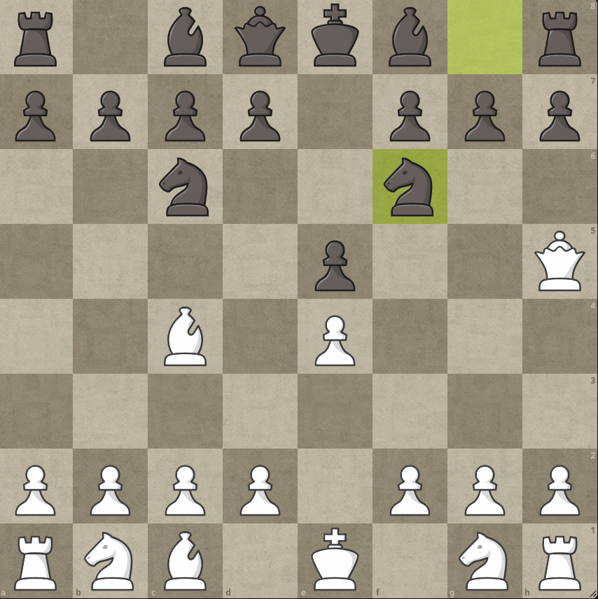
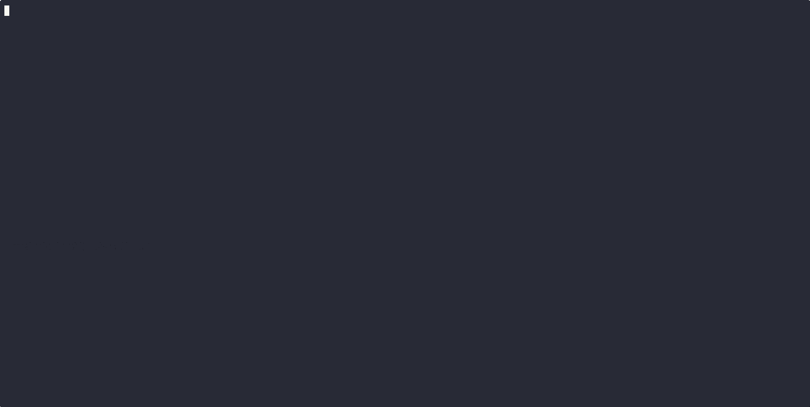

#  Rust Chess Engine


A simple chess engine written in Rust, implementing a Negamax search algorithm.  
Currently supports move generation and evaluation, with a basic Negamax search. Alpha-beta pruning and more are planned for future improvements.

### Build and Run

```bash
git clone https://github.com/yourusername/rustmate.git
cd rustmate
# Build the project
cargo build --release

# Run the engine
cargo run

# Run the engine with a custom FEN position
cargo run -- --fen "{your_fen_string}"
```
## 📄 Example
### Example of the engine choosing a move in a sample position:





## 🧱 Project Structure

```bash
src/
├──main.rs          # Entry point
└──mod/
    ├──parse_fen.rs      # FEN string parsing
    ├──board.rs          # Bitboard logic and board display
    ├──evaluation.rs     # Evaluation function
    ├──game_over.rs      # Simple mating logic
    ├──make_move.rs      # Legal move application
    ├──movegen.rs        # Pseudo-legal move generation
    └──search.rs         # Negamax search algorithm

```

## 🤝 Contributing

Pull requests and ideas are welcome! This is a learning-driven, open project — feel free to fork it and experiment.
## 📝 License

This project is licensed under the MIT License.  

© 2025 Marcin Wiśniewski

